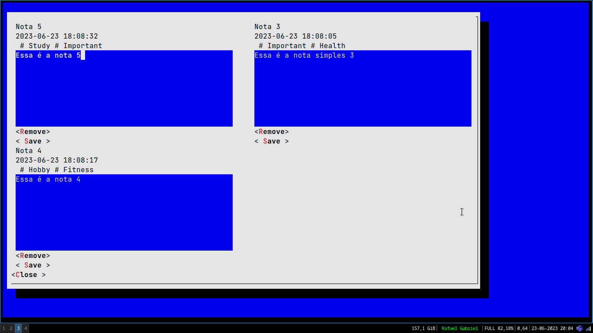

## `stns`: Simple Terminal Note System

Esse é projeto final desenvolvido para as disciplinas de Programação Orientada a Objetos e
Banco de Dados do Inatel.

**OBS:** Ao rodar o projeto na interface gráfica e pressionar os botões de remoção e salvamento de 
notas, pode parecer que a aplicação travou. Para solucionar o problema, pressione a tecla `Tab` em seu 
teclado. Ela fará com que o foco retorne à interface.
